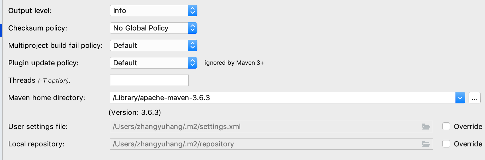
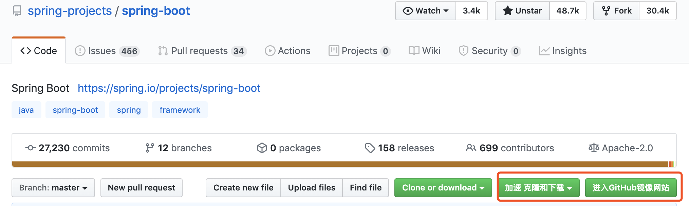

## 1 前言
这是SpringBoot2.1.0源码分析专题的第一篇文章，主要讲如何来搭建我们的源码阅读调试环境。如果有经验的小伙伴们可以略过此篇文章。
## 2 环境安装要求
* IntelliJ IDEA
* JDK1.8
* Maven3.5以上
  * 其中如果Maven版本过低，比如目前我使用的是mac idea2018内置maven版本为3.3.9，则必须要进行idea升级或者使用外部maven安装方式，我选择了后者。
  * 参见：[mac下载安装maven](https://www.jianshu.com/p/3322d6e64a81)
  * 安装好后只需把idea选择maven的方式改变一下
  
  

## 3 从github上将SpringBoot源码项目下载下来
首先提供**SpringBoot2.1.0**的github地址：
https://github.com/spring-projects/spring-boot/tree/v2.1.0.RELEASE

因为要进行阅读源码和分析源码项目，我们是不是要在里面写一些注释帮助我们阅读理解源码，因此需要将SpringBoot源码项目fork到自己的github仓库中，然后再利用**git clone url**命令将已经fork到自己github仓库的SpringBoot源码拉取下来即可。
但由于以上方式往往很慢，通常会超时，所以

* 方式一、笔者直接将SpringBoot项目直接下载下来，将SpringBoot源码项目导入到IDEA中将刚才下载的spring-boot2.1.0.RELEASE项目选择maven方式导入到IDEA中，然后一直next即可导入完成，注意选择JDK版本是1.8，maven版本是3.5+。

> 

> 
此时下载maven依赖是一个漫长的等待过程，建议maven没有配置（阿-里-云）仓库的小伙伴们配置一下，这样下载速度会快很多。参考[配置maven使用（阿-里-云）仓库](https://blog.csdn.net/zhuzj12345/article/details/93200211)进行配置即可。

* 方式二、采用github插件

    > 

    > 

## 4 编译构建SpringBoot源码项目
此时导入项目后，我们进行编译构建SpringBoot源码项目了，在构建之前做两个配置：
1. 我们要禁用maven的代码检查，在根pom.xml中增加一下配置即可，如下图：
> 
2. 可能有的小伙伴们的pom.xml文件的project标签上显示`java.lang.OutOfMemoryError`错误，这是因为IDEA里的Maven的importer设置的JVM最大堆内存过小而导致的，如下图,此时可参考[Maven依赖包导入错误（IntelliJ IDEA）](https://blog.csdn.net/w605283073/article/details/85107497)解决即可。
> 
3. 把spring-boot-project/spring-boot-tools中的gradle module移除并注释掉pom中该module引入，否则引起package失败
```yaml
<modules>
		<module>spring-boot-antlib</module>
		<module>spring-boot-autoconfigure-processor</module>
		<module>spring-boot-configuration-metadata</module>
		<module>spring-boot-configuration-processor</module>
		<!--<module>spring-boot-gradle-plugin</module>-->
		<module>spring-boot-loader</module>
		<module>spring-boot-loader-tools</module>
		<module>spring-boot-maven-plugin</module>
		<module>spring-boot-test-support</module>
	</modules>
```

4. **注意此步骤是可选择的，因为spring-boot-samples module依赖的三方包太多，导致build变慢，程序运行消耗cpu和内存，如果想测试自己单独启用某个包，或者自己创建**

   把SpringBoot自带的sample包全部导入到项目中(选择maven方式导入)，并在根pom添加module

   > 

   > 

## 5 打包项目

进行了上面配置后，此时我们就可以直接执行以下maven命令来编译构建源码项目了。

```
mvn clean install -DskipTests -Pfast -e -X(-e -X输出错误信息)
```


此时又是漫长的等待，我这里等待5分钟左右就显示构建成功了，如下图：

```java
[INFO] Spring Boot Build 2.1.0.RELEASE .................... SUCCESS [  0.907 s]
[INFO] Spring Boot Dependencies 2.1.0.RELEASE ............. SUCCESS [  1.002 s]
[INFO] Spring Boot Parent 2.1.0.RELEASE ................... SUCCESS [  0.277 s]
[INFO] Spring Boot Tools 2.1.0.RELEASE .................... SUCCESS [  0.031 s]
[INFO] Spring Boot Testing Support 2.1.0.RELEASE .......... SUCCESS [  2.195 s]
[INFO] Spring Boot Configuration Processor 2.1.0.RELEASE .. SUCCESS [  1.208 s]
[INFO] Spring Boot 2.1.0.RELEASE .......................... SUCCESS [ 13.924 s]
[INFO] Spring Boot Test 2.1.0.RELEASE ..................... SUCCESS [  3.772 s]
[INFO] Spring Boot Auto-Configure Annotation Processor 2.1.0.RELEASE SUCCESS [  0.308 s]
[INFO] Spring Boot AutoConfigure 2.1.0.RELEASE ............ SUCCESS [ 18.489 s]
[INFO] Spring Boot Actuator 2.1.0.RELEASE ................. SUCCESS [  3.579 s]
[INFO] Spring Boot Actuator AutoConfigure 2.1.0.RELEASE ... SUCCESS [  4.316 s]
[INFO] Spring Boot Developer Tools 2.1.0.RELEASE .......... SUCCESS [  1.139 s]
[INFO] Spring Boot Configuration Metadata 2.1.0.RELEASE ... SUCCESS [  0.210 s]
[INFO] Spring Boot Starters 2.1.0.RELEASE ................. SUCCESS [  0.493 s]
[INFO] Spring Boot Logging Starter 2.1.0.RELEASE .......... SUCCESS [  0.507 s]
[INFO] Spring Boot Starter 2.1.0.RELEASE .................. SUCCESS [  0.236 s]
[INFO] Spring Boot Test Auto-Configure 2.1.0.RELEASE ...... SUCCESS [  1.181 s]
[INFO] Spring Boot Test Starter 2.1.0.RELEASE ............. SUCCESS [  0.293 s]
[INFO] Spring Boot Properties Migrator 2.1.0.RELEASE ...... SUCCESS [  0.169 s]
[INFO] Spring Boot Loader 2.1.0.RELEASE ................... SUCCESS [  0.991 s]
[INFO] Spring Boot Loader Tools 2.1.0.RELEASE ............. SUCCESS [  0.525 s]
[INFO] Spring Boot Antlib 2.1.0.RELEASE ................... SUCCESS [  0.483 s]
[INFO] Spring Boot Maven Plugin 2.1.0.RELEASE ............. SUCCESS [  3.956 s]
[INFO] Spring Boot ActiveMQ Starter 2.1.0.RELEASE ......... SUCCESS [  0.415 s]
[INFO] Spring Boot AMQP Starter 2.1.0.RELEASE ............. SUCCESS [  0.196 s]
[INFO] Spring Boot AOP Starter 2.1.0.RELEASE .............. SUCCESS [  0.155 s]
[INFO] Spring Boot Artemis Starter 2.1.0.RELEASE .......... SUCCESS [  0.453 s]
[INFO] Spring Boot JDBC Starter 2.1.0.RELEASE ............. SUCCESS [  0.131 s]
[INFO] Spring Boot Batch Starter 2.1.0.RELEASE ............ SUCCESS [  0.185 s]
[INFO] Spring Boot Cache Starter 2.1.0.RELEASE ............ SUCCESS [  0.110 s]
[INFO] Spring Boot Spring Cloud Connectors Starter 2.1.0.RELEASE SUCCESS [  0.189 s]
[INFO] Spring Boot Data Cassandra Starter 2.1.0.RELEASE ... SUCCESS [  0.428 s]
[INFO] Spring Boot Data Cassandra Reactive Starter 2.1.0.RELEASE SUCCESS [  0.267 s]
[INFO] Spring Boot Data Couchbase Starter 2.1.0.RELEASE ... SUCCESS [  0.401 s]
[INFO] Spring Boot Data Couchbase Reactive Starter 2.1.0.RELEASE SUCCESS [  0.251 s]
[INFO] Spring Boot Data Elasticsearch Starter 2.1.0.RELEASE SUCCESS [  1.036 s]
[INFO] Spring Boot Data JDBC Starter 2.1.0.RELEASE ........ SUCCESS [  0.138 s]
[INFO] Spring Boot Data JPA Starter 2.1.0.RELEASE ......... SUCCESS [  0.451 s]
[INFO] Spring Boot Data LDAP Starter 2.1.0.RELEASE ........ SUCCESS [  0.153 s]
[INFO] Spring Boot Data MongoDB Starter 2.1.0.RELEASE ..... SUCCESS [  0.229 s]
[INFO] Spring Boot Data MongoDB Reactive Starter 2.1.0.RELEASE SUCCESS [  0.178 s]
[INFO] Spring Boot Data Neo4j Starter 2.1.0.RELEASE ....... SUCCESS [  0.268 s]
[INFO] Spring Boot Data Redis Starter 2.1.0.RELEASE ....... SUCCESS [  0.279 s]
[INFO] Spring Boot Data Redis Reactive Starter 2.1.0.RELEASE SUCCESS [  0.164 s]
[INFO] Spring Boot Json Starter 2.1.0.RELEASE ............. SUCCESS [  0.136 s]
[INFO] Spring Boot Tomcat Starter 2.1.0.RELEASE ........... SUCCESS [  0.144 s]
[INFO] Spring Boot Web Starter 2.1.0.RELEASE .............. SUCCESS [  0.214 s]
[INFO] Spring Boot Data REST Starter 2.1.0.RELEASE ........ SUCCESS [  0.261 s]
[INFO] Spring Boot Data Solr Starter 2.1.0.RELEASE ........ SUCCESS [  0.380 s]
[INFO] Spring Boot FreeMarker Starter 2.1.0.RELEASE ....... SUCCESS [  0.144 s]
[INFO] Spring Boot Groovy Templates Starter 2.1.0.RELEASE . SUCCESS [  0.314 s]
[INFO] Spring Boot HATEOAS Starter 2.1.0.RELEASE .......... SUCCESS [  0.183 s]
[INFO] Spring Boot Integration Starter 2.1.0.RELEASE ...... SUCCESS [  0.161 s]
[INFO] Spring Boot Validation Starter 2.1.0.RELEASE ....... SUCCESS [  0.129 s]
[INFO] Spring Boot Jersey Starter 2.1.0.RELEASE ........... SUCCESS [  0.515 s]
[INFO] Spring Boot Jetty Starter 2.1.0.RELEASE ............ SUCCESS [  0.269 s]
[INFO] Spring Boot JOOQ Starter 2.1.0.RELEASE ............. SUCCESS [  0.170 s]
[INFO] Spring Boot Atomikos JTA Starter 2.1.0.RELEASE ..... SUCCESS [  0.148 s]
[INFO] Spring Boot Bitronix JTA Starter 2.1.0.RELEASE ..... SUCCESS [  0.146 s]
[INFO] Spring Boot Log4j 2 Starter 2.1.0.RELEASE .......... SUCCESS [  0.131 s]
[INFO] Spring Boot Mail Starter 2.1.0.RELEASE ............. SUCCESS [  0.130 s]
[INFO] Spring Boot Mustache Starter 2.1.0.RELEASE ......... SUCCESS [  0.111 s]
[INFO] Spring Boot Actuator Starter 2.1.0.RELEASE ......... SUCCESS [  0.164 s]
[INFO] Spring Boot OAuth2/OpenID Connect Client Starter 2.1.0.RELEASE SUCCESS [  0.250 s]
[INFO] Spring Boot OAuth2 Resource Server Starter 2.1.0.RELEASE SUCCESS [  0.143 s]
[INFO] Spring Boot Starter Parent 2.1.0.RELEASE ........... SUCCESS [  0.045 s]
[INFO] Spring Boot Quartz Starter 2.1.0.RELEASE ........... SUCCESS [  0.175 s]
[INFO] Spring Boot Reactor Netty Starter 2.1.0.RELEASE .... SUCCESS [  0.202 s]
[INFO] Spring Boot Security Starter 2.1.0.RELEASE ......... SUCCESS [  0.135 s]
[INFO] Spring Boot Thymeleaf Starter 2.1.0.RELEASE ........ SUCCESS [  0.162 s]
[INFO] Spring Boot Undertow Starter 2.1.0.RELEASE ......... SUCCESS [  0.213 s]
[INFO] Spring Boot WebFlux Starter 2.1.0.RELEASE .......... SUCCESS [  0.207 s]
[INFO] Spring Boot WebSocket Starter 2.1.0.RELEASE ........ SUCCESS [  0.177 s]
[INFO] Spring Boot Web Services Starter 2.1.0.RELEASE ..... SUCCESS [  0.244 s]
[INFO] Spring Boot CLI 2.1.0.RELEASE ...................... SUCCESS [  3.672 s]
[INFO] Spring Boot Docs 2.1.0.RELEASE ..................... SUCCESS [  2.770 s]
[INFO] Spring Boot Build 2.1.0.RELEASE .................... SUCCESS [  0.006 s]
[INFO] Spring Boot Samples 2.1.0.RELEASE .................. SUCCESS [  0.016 s]
[INFO] Spring Boot Ant Sample 2.1.0.RELEASE ............... SUCCESS [02:53 min]
[INFO] Spring Boot ActiveMQ Sample 2.1.0.RELEASE .......... SUCCESS [  0.566 s]
[INFO] Spring Boot Actuator Sample 2.1.0.RELEASE .......... SUCCESS [  0.451 s]
[INFO] Spring Boot Actuator Log4j 2 Sample 2.1.0.RELEASE .. SUCCESS [  0.221 s]
[INFO] Spring Boot Actuator Non-Web Sample 2.1.0.RELEASE .. SUCCESS [  0.193 s]
[INFO] Spring Boot Actuator UI Sample 2.1.0.RELEASE ....... SUCCESS [  0.215 s]
[INFO] Spring Boot Actuator Custom Security Sample 2.1.0.RELEASE SUCCESS [  0.228 s]
[INFO] Spring Boot AMQP Sample 2.1.0.RELEASE .............. SUCCESS [  0.135 s]
[INFO] Spring Boot Simple Animated Banner 2.1.0.RELEASE ... SUCCESS [  0.137 s]
[INFO] Spring Boot AOP Sample 2.1.0.RELEASE ............... SUCCESS [  0.132 s]
[INFO] Spring Boot Atmosphere Sample 2.1.0.RELEASE ........ SUCCESS [  0.248 s]
[INFO] Spring Boot Batch Sample 2.1.0.RELEASE ............. SUCCESS [  0.172 s]
[INFO] Spring Boot Cache Sample 2.1.0.RELEASE ............. SUCCESS [  0.214 s]
[INFO] Spring Boot Custom Layout Sample 2.1.0.RELEASE ..... SUCCESS [  0.182 s]
[INFO] Spring Boot Data Cassandra Sample 2.1.0.RELEASE .... SUCCESS [  3.933 s]
[INFO] Spring Boot Data Couchbase Sample 2.1.0.RELEASE .... SUCCESS [  0.275 s]
[INFO] Spring Boot Data Elasticsearch Sample 2.1.0.RELEASE  SUCCESS [  0.336 s]
[INFO] Spring Boot Data JDBC Sample 2.1.0.RELEASE ......... SUCCESS [  0.224 s]
[INFO] Spring Boot Data JPA Sample 2.1.0.RELEASE .......... SUCCESS [  0.365 s]
[INFO] Spring Boot Data LDAP Sample 2.1.0.RELEASE ......... SUCCESS [  0.161 s]
[INFO] Spring Boot Data MongoDB Sample 2.1.0.RELEASE ...... SUCCESS [  0.253 s]
[INFO] Spring Boot Data Neo4j Sample 2.1.0.RELEASE ........ SUCCESS [  0.176 s]
[INFO] Spring Boot Data Redis Sample 2.1.0.RELEASE ........ SUCCESS [  0.186 s]
[INFO] Spring Boot Data REST Sample 2.1.0.RELEASE ......... SUCCESS [  0.355 s]
[INFO] Spring Boot Data Solr Sample 2.1.0.RELEASE ......... SUCCESS [  0.216 s]
[INFO] Spring Boot Developer Tools Sample 2.1.0.RELEASE ... SUCCESS [  0.194 s]
[INFO] Spring Boot Flyway Sample 2.1.0.RELEASE ............ SUCCESS [  0.320 s]
[INFO] Spring Boot Hateoas Sample 2.1.0.RELEASE ........... SUCCESS [  0.187 s]
[INFO] Spring Boot Integration Sample 2.1.0.RELEASE ....... SUCCESS [  3.485 s]
[INFO] Spring Boot Jersey Sample 2.1.0.RELEASE ............ SUCCESS [  1.193 s]
[INFO] Spring Boot Jetty Sample 2.1.0.RELEASE ............. SUCCESS [  0.179 s]
[INFO] Spring Boot Jetty JSP Sample 2.1.0.RELEASE ......... SUCCESS [ 12.207 s]
[INFO] Spring Boot Jetty SSL Sample 2.1.0.RELEASE ......... SUCCESS [  0.158 s]
[INFO] Spring Boot jOOQ Sample 2.1.0.RELEASE .............. SUCCESS [  3.925 s]
[INFO] Spring Boot JPA Sample 2.1.0.RELEASE ............... SUCCESS [  0.260 s]
[INFO] Spring Boot Atomikos JTA Sample 2.1.0.RELEASE ...... SUCCESS [  0.409 s]
[INFO] Spring Boot Bitronix JTA Sample 2.1.0.RELEASE ...... SUCCESS [  0.260 s]
[INFO] Spring Boot JNDI JTA Sample 2.1.0.RELEASE .......... SUCCESS [  0.558 s]
[INFO] Spring Boot JUnit Jupiter Sample 2.1.0.RELEASE ..... SUCCESS [  4.604 s]
[INFO] Spring Boot Kafka Sample 2.1.0.RELEASE ............. SUCCESS [  0.232 s]
[INFO] Spring Boot Liquibase Sample 2.1.0.RELEASE ......... SUCCESS [  0.160 s]
[INFO] Spring Boot Logback Sample 2.1.0.RELEASE ........... SUCCESS [  0.102 s]
[INFO] Spring Boot Sample OAuth2 Client 2.1.0.RELEASE ..... SUCCESS [  8.560 s]
[INFO] Spring Boot Sample OAuth2 Resource Server 2.1.0.RELEASE SUCCESS [  0.216 s]
[INFO] Spring Boot Profile Sample 2.1.0.RELEASE ........... SUCCESS [  0.130 s]
[INFO] Spring Boot Property Validation Sample 2.1.0.RELEASE SUCCESS [  0.258 s]
[INFO] Spring Boot Quartz Sample 2.1.0.RELEASE ............ SUCCESS [  0.135 s]
[INFO] Spring Boot Sample Reactive OAuth2 Client 2.1.0.RELEASE SUCCESS [  0.208 s]
[INFO] Spring Boot Sample Reactive OAuth2 Resource Server 2.1.0.RELEASE SUCCESS [  0.189 s]
[INFO] Spring Boot Security Sample 2.1.0.RELEASE .......... SUCCESS [  0.125 s]
[INFO] Spring Boot Secure WebFlux Sample 2.1.0.RELEASE .... SUCCESS [  0.197 s]
[INFO] Spring Boot Servlet Sample 2.1.0.RELEASE ........... SUCCESS [  0.370 s]
[INFO] Spring Boot Session Sample 2.1.0.RELEASE ........... SUCCESS [  0.168 s]
[INFO] Spring Boot Session WebFlux Sample 2.1.0.RELEASE ... SUCCESS [  1.307 s]
[INFO] Spring Boot Simple Sample 2.1.0.RELEASE ............ SUCCESS [  0.155 s]
[INFO] Spring Boot Test Sample 2.1.0.RELEASE .............. SUCCESS [  0.341 s]
[INFO] Spring Boot Test Sample No Mockito 2.1.0.RELEASE ... SUCCESS [  0.090 s]
[INFO] Spring Boot TestNG Sample 2.1.0.RELEASE ............ SUCCESS [  0.208 s]
[INFO] Spring Boot Tomcat Sample 2.1.0.RELEASE ............ SUCCESS [  0.155 s]
[INFO] Spring Boot Tomcat JSP Sample 2.1.0.RELEASE ........ SUCCESS [  0.558 s]
[INFO] Spring Boot Tomcat SSL Sample 2.1.0.RELEASE ........ SUCCESS [  0.134 s]
[INFO] Spring Boot Multi-Connector Tomcat Sample 2.1.0.RELEASE SUCCESS [  0.158 s]
[INFO] Spring Boot Traditional Sample 2.1.0.RELEASE ....... SUCCESS [  0.340 s]
[INFO] Spring Boot Undertow Sample 2.1.0.RELEASE .......... SUCCESS [  0.186 s]
[INFO] Spring Boot Undertow SSL Sample 2.1.0.RELEASE ...... SUCCESS [  0.151 s]
[INFO] Spring Boot War Sample 2.1.0.RELEASE ............... SUCCESS [  0.387 s]
[INFO] Spring Boot Web FreeMarker Sample 2.1.0.RELEASE .... SUCCESS [  0.147 s]
[INFO] Spring Boot Web Groovy Templates Sample 2.1.0.RELEASE SUCCESS [  0.260 s]
[INFO] Spring Boot Web JSP Sample 2.1.0.RELEASE ........... SUCCESS [  0.429 s]
[INFO] Spring Boot Web Method Security Sample 2.1.0.RELEASE SUCCESS [  0.252 s]
[INFO] Spring Boot Web Mustache Sample 2.1.0.RELEASE ...... SUCCESS [  0.150 s]
[INFO] Spring Boot Web Secure Sample 2.1.0.RELEASE ........ SUCCESS [  0.181 s]
[INFO] Spring Boot Web Secure Custom Sample 2.1.0.RELEASE . SUCCESS [  0.173 s]
[INFO] Spring Boot Web Secure JDBC Sample 2.1.0.RELEASE ... SUCCESS [  0.189 s]
[INFO] Spring Boot Web Static Sample 2.1.0.RELEASE ........ SUCCESS [  0.419 s]
[INFO] Spring Boot Web UI Sample 2.1.0.RELEASE ............ SUCCESS [  0.183 s]
[INFO] Spring Boot WebFlux Sample 2.1.0.RELEASE ........... SUCCESS [  0.166 s]
[INFO] Spring Boot WebSocket Jetty Sample 2.1.0.RELEASE ... SUCCESS [  0.256 s]
[INFO] Spring Boot WebSocket Tomcat Sample 2.1.0.RELEASE .. SUCCESS [  0.204 s]
[INFO] Spring Boot WebSocket Undertow Sample 2.1.0.RELEASE  SUCCESS [  0.224 s]
[INFO] Spring Boot Web Services Sample 2.1.0.RELEASE ...... SUCCESS [  0.265 s]
[INFO] Spring Boot XML Sample 2.1.0.RELEASE ............... SUCCESS [  0.098 s]
[INFO] Spring Boot Samples Invoker 2.1.0.RELEASE .......... SUCCESS [  0.696 s]
[INFO] helloworld-spring-boot-starter 0.0.1-SNAPSHOT ...... SUCCESS [  0.469 s]
[INFO] spring-boot-ymbj-tests 2.1.0.RELEASE ............... SUCCESS [  0.183 s]
[INFO] spring-boot-generaldemo-tests 2.1.0.RELEASE ........ SUCCESS [  0.497 s]
[INFO] Spring Boot Tests 2.1.0.RELEASE .................... SUCCESS [  0.019 s]
[INFO] ------------------------------------------------------------------------
[INFO] BUILD SUCCESS
[INFO] ------------------------------------------------------------------------
[INFO] Total time:  05:11 min
[INFO] Finished at: 2020-06-22T00:02:30+08:00
[INFO] ------------------------------------------------------------------------

```

## 6 运行SpringBoot自带的sample(或者自己写个sample)
此时我们挑选spring-boot-samples模块下的spring-boot-sample-tomcat样例项目来测试好了，此时启动`SampleTomcatApplication`的`main`函数，启动成功界面如下：


然后我们再在浏览器发送一个HTTP请求，此时可以看到服务端成功返回响应，说明此时SpringBoot源码环境就已经构建成功了，接下来我们就可以进行调试了，如下图：


##  7 动手实践环节

前面已经成功构建了SpringBoot的源码阅读环境，小伙伴们记得自己动手搭建一套属于自己的SpringBoot源码调试环境哦，阅读源码动手调试很重要，嘿嘿。

**下节预告**：
<font color=Blue>我们该如何去分析SpringBoot源码涉及模块及结构？--SpringBoot源码（二）</font>

**原创不易，帮忙Star一下呗**！

该源码分析对应SpringBoot版本为**2.1.0.RELEASE**，本文对应的SpringBoot源码解析项目github地址：https://github.com/yuanmabiji/spring-boot-2.1.0.RELEASE


##8 注意：**作者源码里面有一处大坑、一处小坑**

1. 大坑

   作者不小心敲入的，导致SpringBoot运行时无法反射创建该Bean，如不修改则可直接看到结果。花了2.5小时debug到。。。。。。。

   	> 

2. 小坑

   依据报错自己直观就能判断。

   > 

